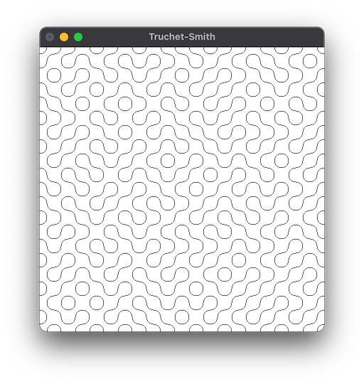

# truchet-smith-using-gloss-demo

Straightforward demo of a Truchet-Smith tiling using the [gloss](https://hackage.haskell.org/package/gloss) library.

## Quick start

    cabal run

Press Escape to close the window. 

## License

Public domain (see the `LICENSE` file.)
